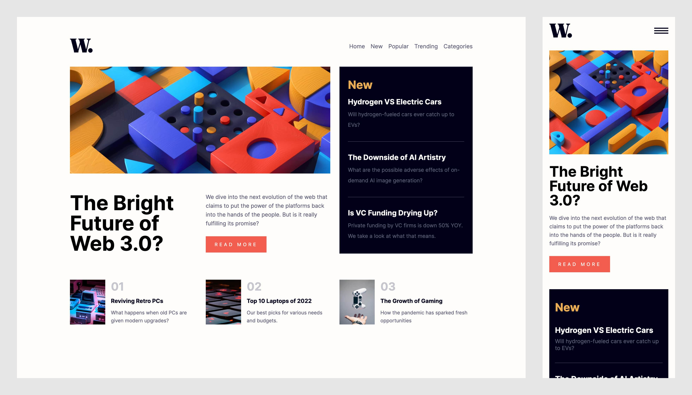

# Frontend Mentor - News homepage solution

This is a solution to the [News homepage challenge on Frontend Mentor](https://www.frontendmentor.io/challenges/news-homepage-H6SWTa1MFl). Frontend Mentor challenges help you improve your coding skills by building realistic projects. 

## Table of contents

- [Overview](#overview)
  - [The challenge](#the-challenge)
  - [Screenshot](#screenshot)
  - [Links](#links)
- [My process](#my-process)
  - [Built with](#built-with)
  - [What I learned](#what-i-learned)
  - [Continued development](#continued-development)
  - [Useful resources](#useful-resources)
- [Author](#author)
- [Acknowledgments](#acknowledgments)

**Note: Delete this note and update the table of contents based on what sections you keep.**

## Overview

### The challenge

Users should be able to:

- View the optimal layout for the interface depending on their device's screen size
- See hover and focus states for all interactive elements on the page

### Screenshot

### Links

- Solution URL: [Add solution URL here](https://your-solution-url.com)
- Live Site URL: [Add live site URL here](https://your-live-site-url.com)

## My process

### Built with

- [SvelteKit](https://kit.svelte.dev/)
- [SASS](https://sass-lang.com/)
- Flexbox
- CSS Grid
- Mobile-first workflow

### What I learned

* I learnt how to approach UI development using the Mobile-First approach. 

* I learnt how to setup SASS on Sveltekit. In addition; I refreshed my knowledge on mixins and variables.

* I learnt how to create a custom responsive navigation bar. 

### Continued development

* I want to focus on creating more delightful UIs. Adding microinteractions to elements of the UI. 

* I want to focus on creating a better responsive navigation bar that fits seamlessly with the entire UI. In this project, the navigation bar pushes elements downwards which definitely needs some improvement. 

### Useful resources

* [Svelte Tutorial](https://svelte.dev/tutorial/basics) - This helped me to understand:
  * Sveltekit setup
  * Use of DOM events in Svelte
  * Tyling in Svelte
  * Nested components in Svelte
  
* [Sveltekit Docs](https://kit.svelte.dev/docs/introduction) - This helped me to understand:
  * Sveltekit setup
  * The use of layouts in Sveltekit
  * The project structure of Sveltekit

* [Sass Docs](https://sass-lang.com/blog) - This helped me to understand:
  - The Sass Language and Syntax

* [Net Ninja Youtube Channel](https://www.youtube.com/playlist?list=PL4cUxeGkcC9hpM9ARM59Ve3jqcb54dqiP) - This helped me to understand:
  * How to structure my custom components and code. 

* [Svelte Add](https://github.com/svelte-add/svelte-add) - This helped me to easily setup Sass for Sveltekit
 
## Author

* Website - [Joseph Akayesi](https://www.josephakayesi.com)
* Frontend Mentor - [@josephakayesi](https://www.frontendmentor.io/profile/josephakayesi)
* Twitter - [@josephakayesi](https://www.twitter.com/josepakayesi)

## Acknowledgments

Hats off to the [Svelte Africa team](https://github.com/Svelte-Africa). I drew inspiration from the official [Svelte Africa website](https://github.com/Svelte-Africa/svelte-africa-website) for conventions in naming and using components
